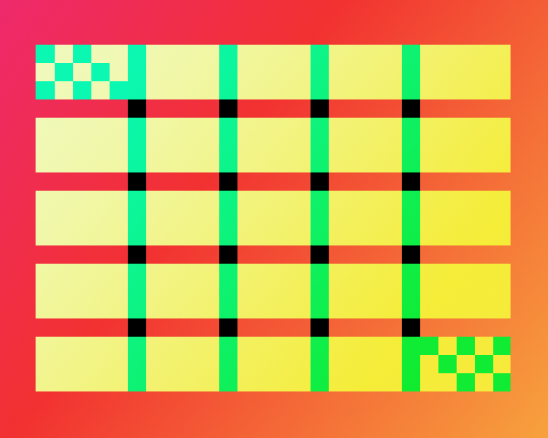
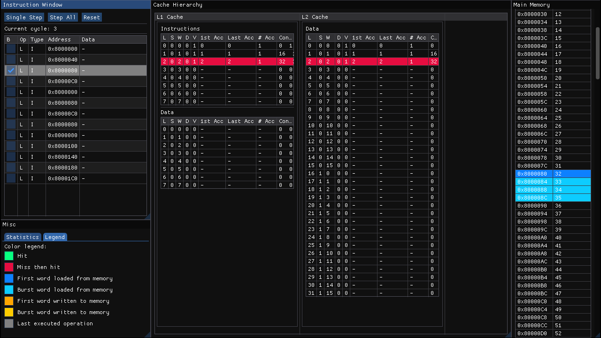
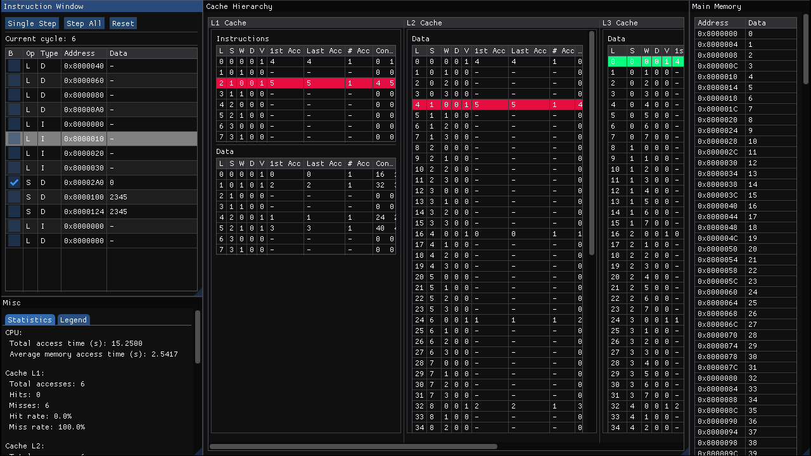

<div align="center">
  
</div>
<h1 align="center">NuCachis</h1>
<h2 align="center">A simple, interactive cache simulator</h2>
<h3 align="center"><a>https://www.atc.unican.es</a></h3>
<div align="center">
  
  
</div>

## About the project
NuCachis is a simple and interactive, trace-based simulator created for educational purposes. Its main features are:
* Memory and cache simulation with support for a configurable number of caches.
* Support for different replacement policies: LRU, FRU, RANDOM and FIFO.
* Support for Write-Back Allocate and Write-Through policies.
* Support for full, direct, and n-way associativity.
* Support for separate instruction and data caches.
* Fast and easy to use ImGui-based graphical interface, or alternatively, CLI only mode.
* Statisics generation with access count, miss, hit and access time statistics.

## Getting started
### Prerequisites
The GUI requires OpenGL and SDL2. For Debian based systems, install the following dependencies:
```
apt-get install cmake gcc git libsdl2-dev libgl1-mesa-dev libglu1-mesa-dev
```

### Installation
1. Clone the repository:
```
git clone https://github.com/aiechevarria/nucachis.git
```

2. Run cmake:
```
cd nucachis
mkdir build
cd build
cmake ..
cmake --build .
```

## Usage
By default NuCachis will run in GUI mode. A configuration and a trace are required for simulations. Please check the documentation for [.ini](./docs/ini.md) and [.vca](./docs/vca.md) file formatting.

Output of `./nucachis -h`:

```
NuCachis. A simple, interactive cache simulator 


./NuCachis [OPTIONS]


OPTIONS:
  -h,     --help              Print this help message and exit 
  -c,     --config TEXT:FILE  Path to the configuration file 
  -t,     --trace TEXT:FILE   Path to the trace file 
  -d,     --debug :INT in [0 - 2] [0]  
                              Debug verbosity 
  -g,     --nogui             Disable the GUI 
```


